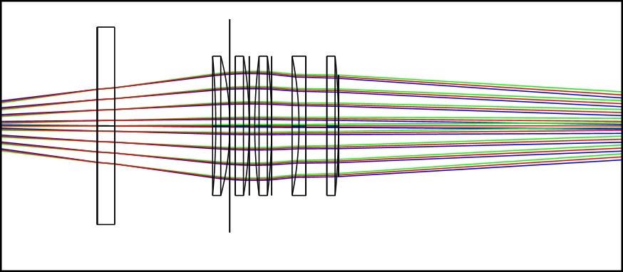

	- TODO
	- Add lens details
	- Add design notes and useful literature.

# Twins imaging lenses

There are 3 imaging directions for the Twins ion trap system. Above and below the trap, and across the thin isthumus of the HOA device.

below is a constrained in-vacuum pair of lenses feature a edmund Gradium 10mm lens followed by a spherical f=100mm

Above the device is a 4-lens composite system with a magnification of ~10, and near diffraction limited performance at an NA=0.34

The side-lens is limited by the optical access through a vacuum window 120mm away. This is a 4-lens composite system with a magnification of ~5.

# Side-lens 

